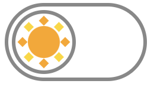

# shine-and-bright

Dark and Light Theme Switch CSS

[](https://www.npmjs.com/package/shine-and-bright)

## Installation

```sh
npm i shine-and-bright
```

## Usage

Include `shine-and-bright/index.css` in your application.  
Below is an example of including it in the root CSS.

```css
@import url("./node_modules/shine-and-bright/index.css");
```

### Markup

**Switch**:

```html
<button class="snb-shine-and-bright-switch">
  <span class="snb-shine-and-bright"></span>
</button>
```

It changes to a moon icon when an ancestor element has `dark` class.  
e.g.:

```html
<button id="foo" class="snb-shine-and-bright-switch">
  <span class="snb-shine-and-bright"></span>
</button>
<script>
  document.querySelector("#foo").addEventListener("click", () => {
    document.documentElement.classList.toggle("dark");
  });
</script>
```

 <-> 

**Icon only**:

```html
<button class="snb-shine-and-bright"></button>
```

It changes to a moon icon when an ancestor element has `dark` class.

**Moon only**:

```html
<button class="snb-shine"></button>
```

**Sun only**:

```html
<button class="snb-bright"></button>
```

### Customization

You can customize some styles using CSS properties.

```css
:root {
  --snb-icon-size: 18px; /* default 18px */
  --snb-animation-duration: 300ms; /* default 300ms */
  --snb-switch-width: 40px; /* default 40px (when 18px) */
  --snb-switch-padding: 1px; /* default 1px (when 18px) */
  --snb-switch-border-width: 1px; /* default 1px (when 18px) */
  --snb-switch-border-color: #888; /* default #888 */
  --snb-bright-color: orange; /* default orange */
  --snb-bright-color-second: gold; /* default gold */
  --snb-shine-color: yellow; /* default yellow */
}
```
